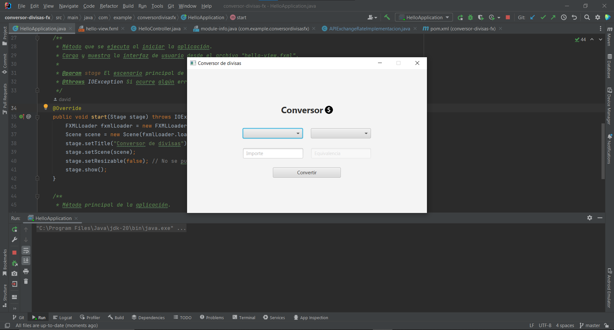

# Conversor de Divisas FX

Este proyecto es un Conversor de Divisas desarrollado en JavaFX. Utiliza una API externa para obtener las tasas de cambio y realizar las conversiones entre diferentes monedas.

## Características

- Conversión de divisas: Permite convertir una cantidad de una moneda a otra seleccionando las monedas base y de destino.
- Validación de entrada: Verifica que el valor ingresado para la cantidad a convertir sea un número válido.
- Interfaz de usuario intuitiva: La aplicación cuenta con una interfaz de usuario sencilla y fácil de usar.

## Requisitos del sistema

- Java 19 o superior.

## Instalación y ejecución

1. Clona el repositorio o descarga los archivos en tu máquina local.
2. Abre el proyecto en tu entorno de desarrollo Java preferido.
3. Asegúrate de tener las dependencias necesarias configuradas en tu proyecto.
4. Ejecuta la clase `HelloApplication` para iniciar la aplicación.

## Configuración de la API

Este proyecto utiliza la API de ExchangeRate para obtener las tasas de cambio. Para utilizarla, necesitas obtener una clave de acceso a la API y configurarla en la clase `APIExchangeRateImplementacion`. Busca el siguiente código:

```java
String endpoint = "https://v6.exchangerate-api.com/v6/7a3736d8401e85227eae59ef/pair/" + base + "/" + destino + "/" + importe;
```

Reemplaza `7a3736d8401e85227eae59ef` con tu clave de acceso a la API de ExchangeRate.

## Contribuciones

Las contribuciones son bienvenidas. Si encuentras algún problema o tienes sugerencias de mejora, no dudes en abrir un issue o enviar una solicitud de pull.

## Licencia

Este proyecto se distribuye bajo la licencia [MIT](https://opensource.org/licenses/MIT).

# Material grafico

